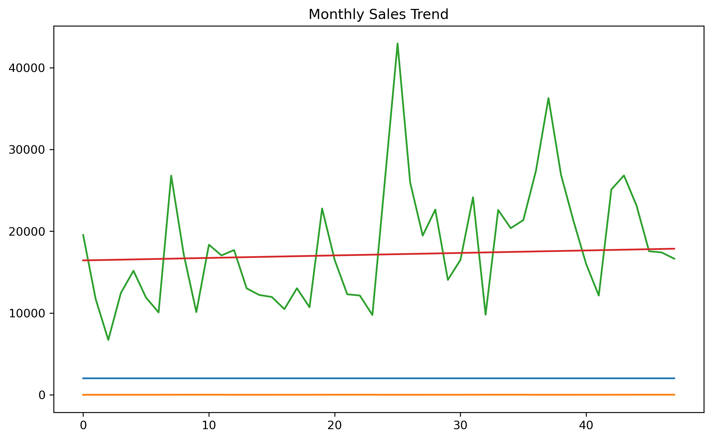
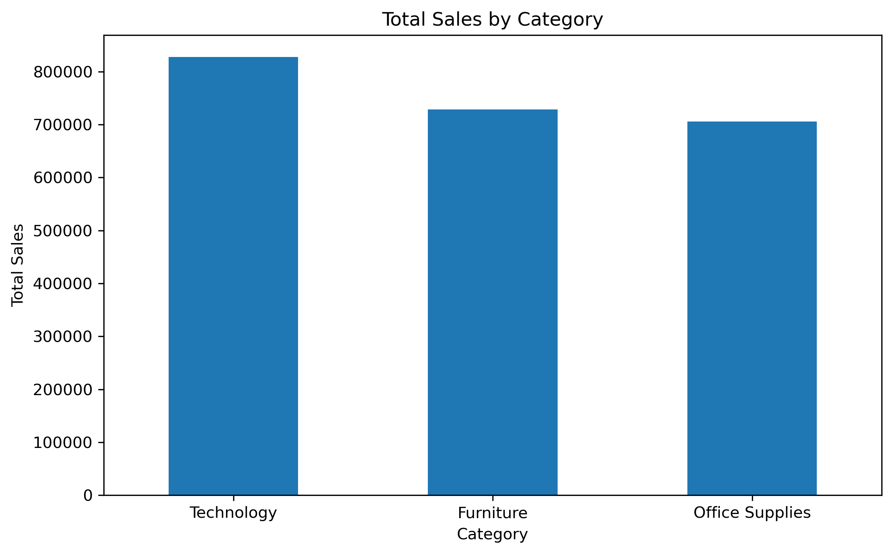

# Sales Data Analysis (EDA)

## Overview
This project performs exploratory data analysis on a retail superstore dataset to uncover sales trends, category performance, and high-impact products.

## Tools Used
- Python
- Pandas, NumPy
- Matplotlib
- SQL (planned)
- Statistics

## Key Insights
- Sales fluctuate over time rather than showing consistent growth.
- Technology is the strongest revenue-generating category.
- A small number of products drive a large portion of total sales.

## Visuals

## Project Status
✅ EDA completed  
🚧 SQL analysis next
